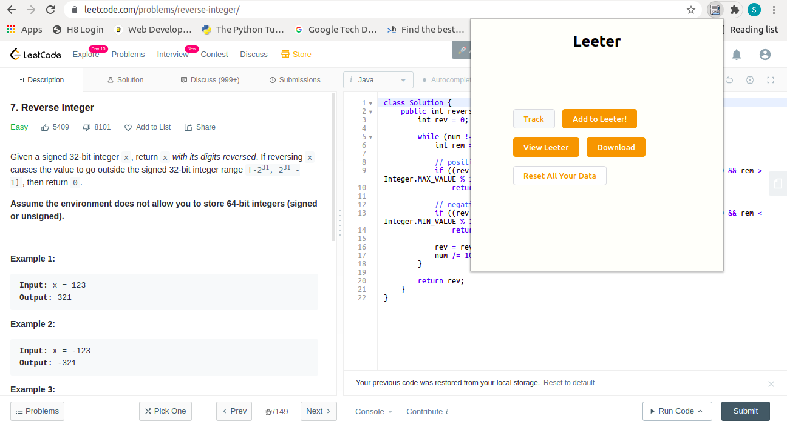

# Leeter
A chrome extension that keeps a log of all your LeetCode solutions. You can directly download the problem logs or check out all your solutions organized in one place!

 

## Features
With Leeter you can:

 - **Track** - Gives you a quick overview of the problem title, difficulty level etc. before you can save it.
 - **Add to Leeter** - This will add the problem information as well as current date and problem URL for future reference.
 - **View Leeter** - This takes you to the home page where you can view all your solved problems in an organized manner!
 - **Download** - This lets you download all the problem logs as a basic text file.
 - **Reset** - This will clear all your previously saved problems.  

   

## How to install on your computer
- Simply fork this repo and in your local computer clone this using `git clone`.
- Then head to Chrome Extension [page](chrome://extensions/) and turn on Developer's mode.
- Click on 'Load Unpacked' and upload your file.
- That's it!
