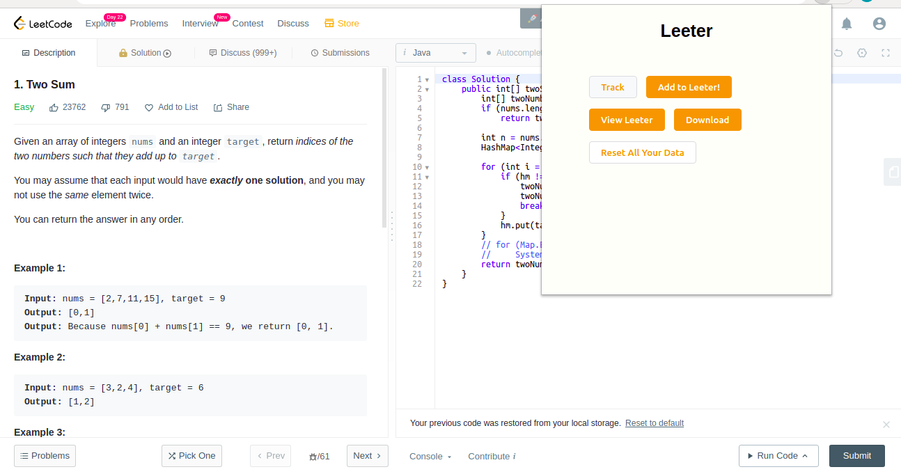
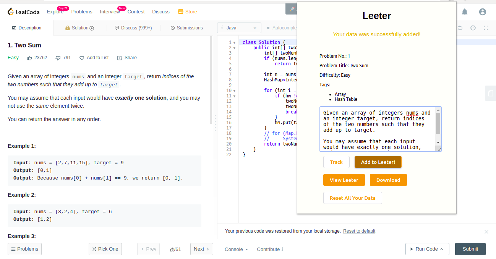
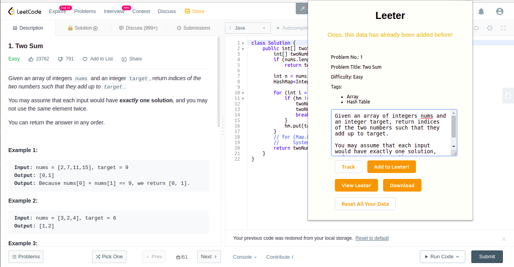
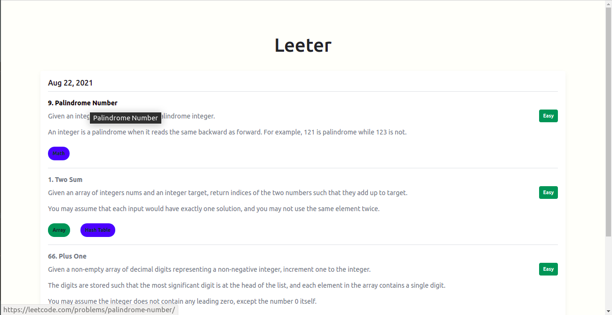
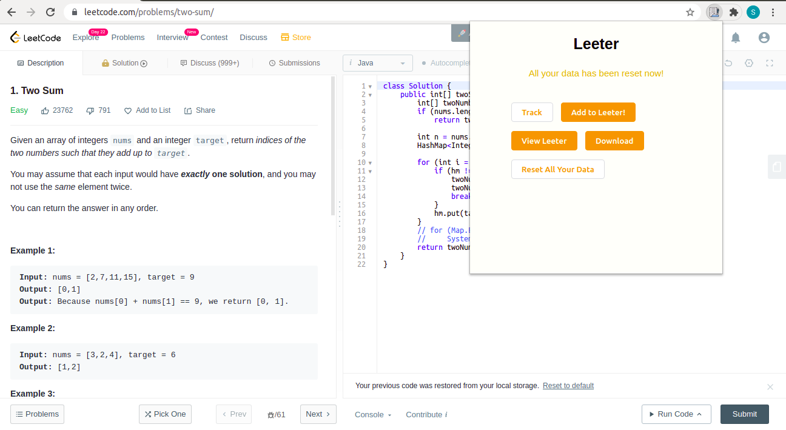

# Leeter

A chrome extension that keeps a log of all your LeetCode solutions. You can directly download the problem logs or check out all your solutions organized in one place!

 

## Features

With Leeter you can:

- **Track** - Gives you a quick overview of the problem title, difficulty level etc. before you can save it. You can optionally add your additional notes/ problem approach as well.
- **Add to Leeter** - This will add the problem information as well as current date and problem URL for future reference.
- **View Leeter** - This takes you to the home page where you can view all your solved problems in a submission date-wise organized manner!
- **Download** - This lets you download all the problem logs as a basic text file.
- **Reset** - This will clear all your previously saved problems.

   

## Get Started!

1. Open the 'Leeter' chrome extension and click on 'Track'.
     
   
     

2. Get a quick overview of the problem and optionally include any additional notes/ problem approach etc. that you would like to keep in mind, and then click on 'Add to Leeter'.
     
   
     
3. No worries if you accidentally hit enter on the exact same data twice.
     
   
     

3. Get all your data organized in a neat, date-wise manner with difficulty level, problem tags mentioned alongside your personal notes! You can also click on a problem title to directly be redirected to the problem page in a new tab.
     
   
     

4. Reset your data logs any time!
     
   
     

## How to install on your computer

- Simply fork this repo and in your local computer clone this using `git clone`.
- Then head to Chrome Extension [page](chrome://extensions/) and turn on Developer's mode.
- Click on 'Load Unpacked' and upload your file.
- That's it!
